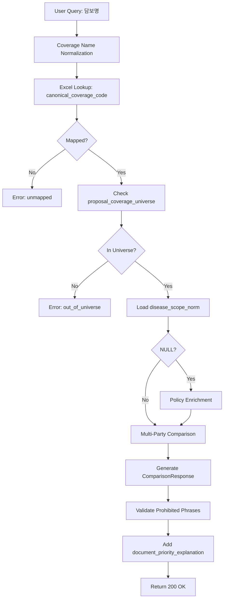

# STEP 10: User Response Contract (가입설계서 기반 비교 응답 안정화)

**Date:** 2025-12-24
**Base:** STEP 9 (feature/step9-proposal-based-3insurer-comparison)
**Purpose:** 가입설계서 기반 비교 결과를 실제 사용자 응답(API/UI) 수준으로 안정화

---

## 0. Constitutional Requirement (절대 원칙)

### 문서 우선순위 원칙 (헌법 레벨)

**본 시스템은 약관 중심 시스템이 아니다.**

1. **가입설계서 (Proposal)** = 비교 대상 SSOT (What to compare)
2. **상품요약서 (Product Summary)** = 일반적 설명
3. **사업방법서 (Business Rules)** = 실무 제약 조건
4. **약관 (Policy)** = 법적 해석 근거 (How to interpret)

**약관은 비교 대상을 결정하지 않는다.**

---

## 1. Problem Statement

### Current State (STEP 9)
- ✅ 3-insurer comparison logic complete
- ✅ Structured response schema defined
- ✅ Prohibited phrases validation working
- ✅ Evidence included at all levels

**But: No user-facing API contract or E2E flow documentation**

### STEP 10 Goal

**가입설계서 기반 비교 결과를 사용자 응답 수준으로 안정화**

1. STEP 9 구조화 응답을 API 계약으로 고정
2. 사용자 질의 → 가입설계서 담보 매칭 → 비교 응답까지 E2E 플로우 명시
3. 문서별 근거 출력 순서 고정
4. 가입설계서 없는 담보 비교 시 즉시 오류 반환

---

## 2. API Response Contract

### 2.1 Response Structure (STEP 9 기준 고정)

**STEP 9에서 완성된 구조를 그대로 사용:**

```json
{
  "comparison_state": "comparable_with_gaps",
  "coverage_code": "CANCER_DIAGNOSIS",
  "coverage_name": "일반암진단비",
  "insurers": [
    {
      "insurer": "SAMSUNG",
      "disease_scope_norm": {
        "include_group_id": "GENERAL_CANCER_C00_C97",
        "exclude_group_id": "SIMILAR_CANCER_SAMSUNG_V1"
      },
      "evidence": {
        "basis_doc_id": "SAMSUNG_POLICY_2024",
        "basis_page": 12,
        "basis_span": "유사암이라 함은 갑상선암(C73)..."
      }
    },
    {
      "insurer": "MERITZ",
      "disease_scope_norm": {
        "include_group_id": "GENERAL_CANCER_C00_C97",
        "exclude_group_id": "SIMILAR_CANCER_MERITZ_V1"
      },
      "evidence": {
        "basis_doc_id": "MERITZ_POLICY_2024",
        "basis_page": 9,
        "basis_span": "유사암: 갑상선암(C73)..."
      }
    },
    {
      "insurer": "DB",
      "disease_scope_norm": null,
      "evidence": null
    }
  ],
  "comparison_reason": {
    "reason_code": "disease_scope_partial_overlap",
    "summary_ko": "삼성과 메리츠의 유사암 정의에 교집합이 있으나, DB의 정의는 약관에서 추출되지 않았습니다. 약관 확인이 필요합니다.",
    "evidence_refs": [
      {"insurer": "SAMSUNG", "doc_id": "SAMSUNG_POLICY_2024", "page": 12},
      {"insurer": "MERITZ", "doc_id": "MERITZ_POLICY_2024", "page": 9}
    ]
  },
  "prohibited_phrases_check": "PASS",
  "document_priority_explanation": {
    "basis": "proposal",
    "enrichment_sources": ["policy"],
    "description": "비교 대상은 가입설계서 기준이며, 약관은 정의 보강 목적으로만 사용되었습니다."
  }
}
```

### 2.2 New Field: document_priority_explanation

**STEP 10에서 추가:**

문서 우선순위를 사용자에게 명시적으로 전달하는 필드.

```json
{
  "document_priority_explanation": {
    "basis": "proposal",
    "enrichment_sources": ["policy"],
    "description": "비교 대상은 가입설계서 기준이며, 약관은 정의 보강 목적으로만 사용되었습니다."
  }
}
```

**필드 설명:**
- `basis`: 비교 대상 출처 (항상 "proposal")
- `enrichment_sources`: 보강에 사용된 문서 유형 배열
- `description`: 사용자용 설명 (한국어)

---

## 3. E2E User Flow

### 3.1 Happy Path (비교 성공)

```
User Query: "일반암진단비 비교해줘"
    ↓
Step 1: Coverage Matching (가입설계서 기준)
    - Query → Coverage name normalization
    - Excel lookup → canonical_coverage_code
    - proposal_coverage_universe check (3 insurers)
    ↓
Step 2: Universe Lock Validation
    - All 3 insurers have coverage in proposal? YES
    - mapping_status = MAPPED? YES
    ↓
Step 3: Disease Scope Enrichment (약관 기준)
    - Load disease_scope_norm from proposal_coverage_slots
    - If NULL → policy enrichment (evidence required)
    ↓
Step 4: Multi-Party Comparison (STEP 8 logic)
    - Compute pairwise overlap
    - Aggregate to single state
    ↓
Step 5: Generate Structured Response (STEP 9 logic)
    - Create ComparisonResponse
    - Validate prohibited phrases
    - Include evidence references
    - Add document_priority_explanation
    ↓
User Response: Structured JSON (200 OK)
```

### 3.2 Error Path: Coverage Not in Proposal

```
User Query: "암 사망보험금 비교해줘"
    ↓
Step 1: Coverage Matching
    - Query → Coverage name normalization
    - Excel lookup → canonical_coverage_code (found)
    ↓
Step 2: Universe Lock Validation
    - proposal_coverage_universe check → NOT FOUND
    ↓
Error Response (400 Bad Request):
{
  "error": "out_of_universe",
  "message": "해당 담보는 가입설계서에 존재하지 않아 비교할 수 없습니다.",
  "coverage_code": "CANCER_DEATH_BENEFIT",
  "reason": "Coverage not found in any proposal_coverage_universe",
  "suggestion": "가입설계서에 포함된 담보만 비교 가능합니다."
}
```

### 3.3 Error Path: Coverage Not Mapped

```
User Query: "알 수 없는 담보명 비교"
    ↓
Step 1: Coverage Matching
    - Query → Coverage name normalization
    - Excel lookup → NOT FOUND
    ↓
Error Response (400 Bad Request):
{
  "error": "unmapped",
  "message": "해당 담보명은 매핑되지 않았습니다.",
  "raw_coverage_name": "알 수 없는 담보명",
  "reason": "No matching canonical_coverage_code in Excel",
  "suggestion": "담보명을 확인하거나 관리자에게 문의하세요."
}
```

---

## 4. Document Evidence Order (고정)

### 4.1 응답 내 문서 근거 출력 순서

모든 사용자 응답에서 문서 근거는 다음 순서로 제공:

1. **가입설계서 기준 설명** (필수)
   - "이 담보는 가입설계서에 존재합니다."
   - Universe ID, insurer, proposal_id 명시

2. **상품요약서 요약** (선택)
   - 담보 개요, 주요 조건
   - 고객용 설명 텍스트

3. **사업방법서 조건** (선택)
   - 실무 제약 조건 (연령, 기간, 조합 규칙)
   - 설계 가능 범위

4. **약관 근거** (필요한 경우만)
   - 질병 정의, 면책 사유
   - 법적 판단이 필요한 경우만 포함

### 4.2 Constitutional Requirement

**약관 근거는 항상 마지막에 위치한다.**

- ❌ 약관 먼저 설명 → 가입설계서 언급
- ✅ 가입설계서 확인 → (필요시) 약관 참조

---

## 5. Prohibited Operations (명시적 금지)

### 5.1 STEP 10에서 하지 말 것

- ❌ 새로운 비교 로직 설계
- ❌ 약관 기반 자동 추론
- ❌ 자연어 요약/추천 문장 생성
- ❌ "어느 보험사가 더 유리" 같은 평가
- ❌ STEP 9 ComparisonResponse 스키마 변경

### 5.2 Constitutional Violations

다음은 헌법 위반:

- ❌ 약관에만 있는 담보를 비교 대상에 추가
- ❌ proposal_coverage_universe 없이 비교 시작
- ❌ 문서 우선순위 역전 (약관 → 가입설계서)
- ❌ out_of_universe 오류를 무시하고 추정

---

## 6. Implementation Plan (STEP 10)

### 6.1 Phase A: API Contract Definition

**Deliverables:**
1. `api/compare_response.schema.json` (JSON Schema)
2. Update OpenAPI spec with document_priority_explanation
3. Document E2E flow in this file

**DoD:**
- ✅ JSON Schema validates STEP 9 response
- ✅ document_priority_explanation field defined
- ✅ Error response schemas defined (out_of_universe, unmapped)

### 6.2 Phase B: E2E Flow Documentation

**Deliverables:**
1. Flow diagrams (Mermaid)
2. Error handling specifications
3. Document evidence order rules

**DoD:**
- ✅ Happy path documented
- ✅ Error paths documented (out_of_universe, unmapped)
- ✅ Document priority enforced in examples

### 6.3 Phase C: Integration Test (Optional)

**Deliverables:**
1. `tests/integration/test_step10_user_flow.py`

**Test Scenarios:**
- Happy path: 3-insurer comparison (uses STEP 9 logic)
- Error: out_of_universe
- Error: unmapped
- Verify document_priority_explanation present
- Verify prohibited phrases = PASS

**DoD:**
- ✅ All tests PASS
- ✅ No new comparison logic (reuses STEP 9)

---

## 7. Success Criteria (DoD)

### 7.1 API Contract

- ✅ STEP 9 response structure preserved
- ✅ document_priority_explanation field added
- ✅ Error response schemas defined
- ✅ JSON Schema validation ready

### 7.2 E2E Flow

- ✅ Happy path documented (가입설계서 → 약관 순서)
- ✅ Error paths documented (out_of_universe, unmapped)
- ✅ Document evidence order enforced

### 7.3 Constitutional Compliance

- ✅ 가입설계서 = 비교 대상 SSOT (no violations)
- ✅ 약관 = Evidence Enrichment only
- ✅ No prohibited phrases (validated)
- ✅ No value judgments or recommendations
- ✅ Document priority never reversed

### 7.4 Implementation Scope

- ✅ No new comparison logic (STEP 9 reused)
- ✅ No LLM-based inference
- ✅ All responses structured (JSON)
- ✅ Immediate error on out_of_universe

---

## 8. Non-Goals (명시적 제외)

**STEP 10에서 하지 않는 것:**

1. ❌ 새로운 multi-party overlap detection logic
2. ❌ 자연어 질의 이해 (NLU)
3. ❌ 담보명 자동 교정 (typo correction)
4. ❌ 사용자 추천 시스템
5. ❌ 프론트엔드 UI 구현
6. ❌ API 인증/권한 시스템

**이유:** STEP 10은 STEP 9 결과의 안정화에 집중. 새로운 기능 추가 금지.

---

## 9. Testing Requirements

### 9.1 Contract Tests

**Validation:**
- JSON Schema validation for response
- Error response schema validation
- Field presence checks (document_priority_explanation)

### 9.2 Integration Tests

**Scenarios:**
1. Happy path: 3-insurer comparison (STEP 9 reuse)
2. Error: out_of_universe (coverage not in proposal)
3. Error: unmapped (coverage not in Excel)
4. Verify document_priority_explanation field
5. Verify prohibited_phrases_check = PASS
6. Verify evidence order (proposal → policy)

### 9.3 Constitutional Tests

**Prohibition Tests:**
- No policy-first language in responses
- No comparison without proposal_coverage_universe
- No value judgments (prohibited phrases blocked)

---

## 10. Documentation Requirements

### 10.1 API Contract

**File:** `api/compare_response.schema.json`

JSON Schema for ComparisonResponse with document_priority_explanation.

### 10.2 Design Document

**File:** `docs/STEP10_user_response_contract.md` (this file)

Includes:
- Constitutional requirements
- E2E flow diagrams
- Error handling specifications
- Document evidence order rules
- Prohibited operations list

### 10.3 STATUS.md Update

**Section:** STEP 10

Includes:
- Purpose
- Deliverables
- Test results
- Constitutional compliance checklist
- Related commits

---

## 11. Migration from STEP 9

### 11.1 What Changes

**New:**
- document_priority_explanation field
- JSON Schema for validation
- E2E flow documentation
- Error response schemas

**Unchanged:**
- ComparisonResponse structure (STEP 9)
- Multi-party overlap logic (STEP 8)
- Policy parsers (STEP 8)
- Universe Lock validation (STEP 7)
- Prohibited phrases validation (STEP 9)

### 11.2 Backward Compatibility

**STEP 10 is backward compatible with STEP 9:**

- Existing ComparisonResponse consumers work as-is
- document_priority_explanation is additive (optional field)
- No breaking changes to comparison logic

---

## 12. References

- STEP 7: Universe Lock + Policy Scope Pipeline v1
- STEP 8: Multi-Insurer Policy Scope Expansion
- STEP 9: 가입설계서 중심 3사 비교 실전 고정
- CLAUDE.md: 문서 우선순위 원칙 (Constitutional)

---

## Appendix A: Flow Diagram (Mermaid)



---

## Appendix B: Document Priority Example

**User Query:** "일반암진단비의 유사암 정의를 비교해주세요."

**Correct Response Order:**

1. **가입설계서 확인** (필수)
   > "일반암진단비는 삼성, 메리츠, DB 가입설계서에 모두 존재합니다."

2. **상품요약서 요약** (선택)
   > "일반암진단비는 암 진단 시 지급되는 담보입니다. (유사암 제외)"

3. **사업방법서 조건** (선택)
   > "가입 연령: 20~60세, 보장 기간: 80세 만기"

4. **약관 근거** (필요한 경우)
   > "삼성 약관 12페이지: 유사암은 갑상선암(C73), 기타피부암(C44)을 의미합니다."
   > "메리츠 약관 9페이지: 유사암은 갑상선암(C73), 기타피부암(C44)을 의미합니다."

**❌ 잘못된 순서 (헌법 위반):**

1. 약관 정의부터 설명
2. 가입설계서 언급 없이 비교 시작
3. "약관이 가장 정확하므로..." 같은 서술

---

**End of Document**
