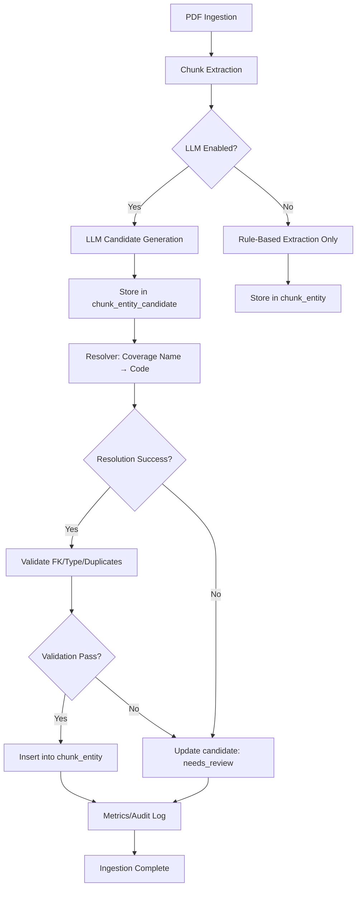

# STEP 6-A: LLM-Assisted Ingestion/Extraction Design (Proposal-Only)

**Status**: Design Phase (No Implementation)
**Version**: 1.0.0
**Date**: 2025-12-23

---

## 0. Executive Summary

### Goal

Improve `chunk_entity` and `amount_entity` quality by using LLM as a **candidate generator** during ingestion/extraction, while maintaining absolute constitutional guarantees:

- ✅ LLM proposes candidates only (not decisions)
- ✅ Code-based resolver validates and confirms
- ✅ `coverage_standard` auto-INSERT forbidden
- ✅ All entities use canonical `coverage_code` (신정원 통일코드)
- ✅ Compare-axis `is_synthetic=false` constitution unchanged (STEP 5 preserved)

### Key Principle

**LLM = Proposal Generator**
**Code = Decision Maker**

---

## 1. Constitutional Principles (Hard Rules)

### 1.1 LLM Usage Boundaries

| Allowed ✅ | Forbidden ❌ |
|-----------|-------------|
| Generate coverage name candidates from text | Decide final coverage_code |
| Suggest entity_type classification | Auto-INSERT into coverage_standard |
| Provide confidence scores | Make binding decisions |
| Extract amount context hints | Calculate/confirm amounts |
| Propose coverage name spans | Bypass validation |

### 1.2 Canonical Coverage Code (신정원 통일코드) Enforcement

1. **Single Source of Truth**: `coverage_standard.coverage_code`
2. **Resolution Path**: LLM output → `coverage_alias` lookup → canonical code
3. **FK Constraint**: All `chunk_entity.coverage_code` MUST exist in `coverage_standard`
4. **Failure Handling**: Unresolved candidates stored separately (not in production tables)
5. **No Guessing**: LLM cannot create new coverage codes

### 1.3 Compare-Axis Constitution (STEP 5)

**Unchanged**:
- `is_synthetic=false` hard-coded in SQL
- Read-only DB transactions
- KRW-only currency
- No LLM in compare response generation

**STEP 6 Scope**: Ingestion/extraction only (before compare queries run)

---

## 2. STEP 6-A Scope

### In Scope ✅

- Design document (this file)
- LLM integration points specification
- Candidate→Resolver→Confirmation pipeline
- Database schema for candidate storage
- Validation/verification strategy
- Test plan (5+ scenarios)
- Cost/performance estimation
- Interface contracts for STEP 6-B implementation

### Out of Scope ❌

- Code implementation (STEP 6-B)
- LLM model selection/fine-tuning
- Production deployment
- UI changes
- Compare/evidence API modifications

---

## 3. LLM-Assisted Pipelines

### 3.1 Chunk → Entity Candidate Generation

**Purpose**: Identify coverage entities within chunk text with higher recall than regex-only methods.

#### Input (to LLM)

```json
{
  "chunk_id": 12345,
  "content": "제자리암 및 경계성 종양 진단비는 가입 후 90일 면책기간 적용...",
  "document_type": "약관",
  "page_number": 15,
  "doc_type_priority": 1,
  "context": {
    "prev_chunk": "암진단비 보장 내용...",
    "next_chunk": "면책사유: ..."
  }
}
```

#### LLM Output (Candidate)

```json
{
  "candidates": [
    {
      "coverage_name_span": "제자리암",
      "entity_type": "definition",
      "confidence": 0.92,
      "text_offset": [0, 4]
    },
    {
      "coverage_name_span": "경계성 종양",
      "entity_type": "definition",
      "confidence": 0.89,
      "text_offset": [8, 13]
    },
    {
      "coverage_name_span": "제자리암 및 경계성 종양 진단비",
      "entity_type": "condition",
      "confidence": 0.85,
      "text_offset": [0, 16]
    }
  ]
}
```

#### Post-Processing (Code-Based Resolver)

1. **Coverage Name Resolution**:
   ```sql
   -- Lookup via coverage_alias
   SELECT coverage_code
   FROM coverage_alias
   WHERE alias_name = '제자리암'
   AND insurer_code = <current_insurer>;

   -- Fallback to coverage_standard (exact match)
   SELECT coverage_code
   FROM coverage_standard
   WHERE coverage_name = '제자리암';
   ```

2. **Validation**:
   - Coverage code exists in `coverage_standard` (FK constraint)
   - Entity type is allowed (`definition`, `condition`, `exclusion`, `amount`, `benefit`)
   - Confidence >= threshold (configurable, default 0.7)
   - No duplicate chunk_id + coverage_code

3. **Outcome**:
   - **Resolved**: Store in `chunk_entity` (production table)
   - **Unresolved**: Store in `chunk_entity_candidate` (review queue)
   - **Rejected**: Log reason, do not store

#### Entity Type Classification

| Entity Type | Description | LLM Hint |
|-------------|-------------|----------|
| `definition` | Coverage definition | "암진단비란...", "제자리암의 정의는..." |
| `condition` | Payment conditions | "지급 조건", "면책기간", "감액기간" |
| `exclusion` | Exclusions | "면책사유", "보장하지 않는 경우" |
| `amount` | Amount context | "진단비 3000만원", "수술비 200만원" |
| `benefit` | Benefit description | "보장 개시일", "갱신 조건" |

---

### 3.2 Amount Candidate Generation (Conservative Approach)

**Current State**: `amount_entity` already has high-quality DB columns (`amount_value`, `amount_text`, `unit`, `confidence`, `method`).

**STEP 6-A Scope**: LLM assists with **context classification only**, NOT amount extraction.

#### What LLM MAY Do ✅

- Classify `context_type`: `direct_amount`, `range`, `table_reference`, `conditional`
- Identify `amount_qualifier`: "최대", "최소", "1회당", "연간 한도"
- Suggest `calculation_hint`: "가입금액의 10%", "기본 보험료 × 계약기간"

#### What LLM MUST NOT Do ❌

- Extract final `amount_value` (existing extraction logic handles this)
- Calculate amounts from formulas (rule-based only)
- Confirm currency unit (KRW-only policy)
- Make binding amount decisions

#### Rationale

Amount extraction is already working well with DB-based columns. LLM adds marginal value with high cost/risk. Focus LLM on coverage entity identification where recall improvement is significant.

**Decision**: Amount LLM assistance is **optional** for STEP 6-A. If implemented, strictly limited to context hints stored in `amount_entity.meta`.

---

## 4. Database Schema Design

### 4.1 Design Decision: Separate Candidate Tables (Recommended)

**Chosen Approach**: Create dedicated candidate tables to prevent pollution of production tables.

**Rejected Alternative**: Store LLM candidates in `chunk_entity` with `meta.source=llm`
- ❌ Pollutes production table with unvalidated data
- ❌ Harder to audit/rollback
- ❌ FK violations if coverage_code unresolved

### 4.2 Schema: `chunk_entity_candidate`

```sql
CREATE TABLE chunk_entity_candidate (
    candidate_id SERIAL PRIMARY KEY,
    chunk_id INTEGER NOT NULL REFERENCES chunk(chunk_id) ON DELETE CASCADE,

    -- LLM Proposal
    raw_span TEXT NOT NULL,  -- Original text span from LLM
    text_offset INTEGER[],   -- [start, end] character positions
    proposed_entity_type VARCHAR(50) NOT NULL,  -- definition/condition/exclusion/amount/benefit
    proposed_coverage_code VARCHAR(100),  -- Nullable: LLM may not provide code
    confidence NUMERIC(3,2) NOT NULL CHECK (confidence >= 0 AND confidence <= 1),

    -- LLM Metadata
    llm_model VARCHAR(100),  -- e.g., "gpt-4-turbo-2024-04-09"
    llm_prompt_version VARCHAR(50),  -- Track prompt changes
    llm_response_raw JSONB,  -- Full LLM response for audit

    -- Resolution Status
    resolver_status VARCHAR(20) NOT NULL DEFAULT 'pending',  -- pending/resolved/rejected/needs_review
    resolver_reason TEXT,  -- Why rejected/needs review
    resolved_coverage_code VARCHAR(100) REFERENCES coverage_standard(coverage_code),  -- Final canonical code
    resolved_entity_type VARCHAR(50),  -- May differ from proposed

    -- Audit
    created_at TIMESTAMP DEFAULT NOW(),
    resolved_at TIMESTAMP,
    resolver_version VARCHAR(50),  -- Code version that resolved this

    -- Constraints
    CONSTRAINT valid_resolver_status CHECK (resolver_status IN ('pending', 'resolved', 'rejected', 'needs_review')),
    CONSTRAINT resolved_code_required CHECK (
        (resolver_status = 'resolved' AND resolved_coverage_code IS NOT NULL) OR
        (resolver_status != 'resolved')
    )
);

CREATE INDEX idx_chunk_entity_candidate_status ON chunk_entity_candidate(resolver_status);
CREATE INDEX idx_chunk_entity_candidate_chunk ON chunk_entity_candidate(chunk_id);
CREATE INDEX idx_chunk_entity_candidate_created ON chunk_entity_candidate(created_at);
```

### 4.3 Schema: `amount_entity_candidate` (Optional)

```sql
CREATE TABLE amount_entity_candidate (
    candidate_id SERIAL PRIMARY KEY,
    chunk_id INTEGER NOT NULL REFERENCES chunk(chunk_id) ON DELETE CASCADE,

    -- LLM Proposal (Context Only)
    context_type VARCHAR(50),  -- direct_amount/range/table_reference/conditional
    amount_qualifier VARCHAR(100),  -- "최대", "1회당", etc.
    calculation_hint TEXT,  -- "가입금액의 10%"
    confidence NUMERIC(3,2) NOT NULL,

    -- LLM Metadata
    llm_model VARCHAR(100),
    llm_response_raw JSONB,

    -- Resolution
    resolver_status VARCHAR(20) NOT NULL DEFAULT 'pending',
    resolver_reason TEXT,

    -- Audit
    created_at TIMESTAMP DEFAULT NOW(),
    resolved_at TIMESTAMP,

    CONSTRAINT valid_resolver_status CHECK (resolver_status IN ('pending', 'resolved', 'rejected'))
);

CREATE INDEX idx_amount_entity_candidate_status ON amount_entity_candidate(resolver_status);
```

**Note**: Amount candidate table is optional. May be deferred to STEP 6-C if chunk_entity LLM proves valuable.

---

## 5. Processing Flow

### 5.1 End-to-End Pipeline



### 5.2 Detailed Steps

#### Step 1: Chunk Creation (Existing)
- Parse PDF → extract text blocks → create `chunk` records
- No changes to existing logic

#### Step 2: LLM Candidate Generation (New)
- **Trigger**: After chunk insert, if `LLM_EXTRACTION_ENABLED=true`
- **Input**: Chunk content + metadata + context (prev/next chunks)
- **Output**: JSON array of candidates
- **Storage**: Insert into `chunk_entity_candidate` with `resolver_status=pending`
- **Error Handling**: LLM failure → log error, continue with rule-based fallback

#### Step 3: Rule-Based Resolver (New)
- **Input**: `chunk_entity_candidate` records where `resolver_status=pending`
- **Process**:
  1. Lookup `raw_span` in `coverage_alias` (insurer-specific)
  2. Fallback to `coverage_standard.coverage_name` (exact match)
  3. Fuzzy match with Levenshtein distance (threshold: 85%)
  4. If multiple matches, pick highest `doc_type_priority`
- **Output**: Update `resolved_coverage_code` and `resolver_status`
- **Rejection Reasons**:
  - `no_match`: No coverage found
  - `ambiguous`: Multiple matches with similar scores
  - `confidence_low`: LLM confidence < threshold
  - `invalid_entity_type`: Proposed type not allowed

#### Step 4: Validation (New)
- **FK Check**: `resolved_coverage_code` exists in `coverage_standard`
- **Type Check**: `resolved_entity_type` in allowed set
- **Duplicate Check**: No existing `chunk_entity` with same `chunk_id + coverage_code`
- **Confidence Check**: `confidence >= 0.7` (configurable)

#### Step 5: Confirmation & Storage (New)
- **Insert into `chunk_entity`**:
  ```sql
  INSERT INTO chunk_entity (chunk_id, coverage_code, entity_type, confidence, meta)
  SELECT
    chunk_id,
    resolved_coverage_code,
    resolved_entity_type,
    confidence,
    jsonb_build_object(
      'source', 'llm',
      'candidate_id', candidate_id,
      'llm_model', llm_model,
      'raw_span', raw_span
    )
  FROM chunk_entity_candidate
  WHERE resolver_status = 'resolved'
    AND resolved_coverage_code IS NOT NULL;
  ```
- **Update candidate**: Set `resolved_at = NOW()`

#### Step 6: Metrics & Audit (New)
- **Metrics to Track**:
  - Total candidates generated
  - Resolution rate (resolved / total)
  - Rejection reasons breakdown
  - Average confidence score
  - LLM cost per chunk
  - Processing time (LLM call + resolver)
- **Audit Log**:
  - All LLM requests/responses (JSONB storage)
  - Resolver decisions with reasons
  - Manual review actions (future: human-in-the-loop)

---

## 6. Validation & Verification Strategy

### 6.1 Validation Layers

| Layer | Validator | Failure Action |
|-------|-----------|----------------|
| 1. LLM Output | JSON schema validation | Reject candidate, log error |
| 2. Coverage Resolution | `coverage_alias` / `coverage_standard` lookup | Mark `needs_review` |
| 3. FK Constraint | `coverage_standard.coverage_code` exists | Reject candidate |
| 4. Entity Type | Allowed type set | Reject candidate |
| 5. Duplicate | `chunk_entity` uniqueness | Skip insert |
| 6. Confidence | Threshold check (≥ 0.7) | Mark `needs_review` |

### 6.2 Failure Handling

**Graceful Degradation**:
- LLM service unavailable → Fall back to rule-based extraction
- Coverage unresolved → Store in candidate table for manual review
- FK violation → Reject and log (never auto-create coverage_standard)

**No Breaking Changes**:
- Existing rule-based extraction continues to work
- Compare API unaffected (queries existing `chunk_entity`)
- STEP 5 constitutional guarantees preserved

---

## 7. Test Plan

### 7.1 Test Scenarios (Minimum 5)

#### Scenario 1: LLM ON/OFF Comparison
- **Input**: Identical chunk set (100 chunks)
- **Variants**:
  - LLM enabled (STEP 6)
  - Rule-based only (STEP 5)
- **Metrics**:
  - Entity count: LLM should have ≥ rule-based (higher recall)
  - Precision: Manual review of 20 samples
  - Coverage code accuracy: All must be canonical
- **Pass Criteria**: LLM recall ≥ rule-based, precision ≥ 90%

#### Scenario 2: Resolver Success/Failure Cases
- **Test Cases**:
  1. **Exact match**: "암진단비" → `A4200_1` (success)
  2. **Alias match**: "암 진단비" → `A4200_1` via `coverage_alias` (success)
  3. **No match**: "xyz보험료" → `needs_review` (expected failure)
  4. **Ambiguous**: "암" → multiple matches → `needs_review` (expected failure)
- **Pass Criteria**: Resolver correctly classifies all cases, no auto-INSERT

#### Scenario 3: FK Violation Prevention
- **Attack Case**: LLM proposes `coverage_code="FAKE_CODE"` (not in `coverage_standard`)
- **Expected**:
  1. Resolver fails to resolve
  2. Candidate marked `rejected` with reason `no_match`
  3. **No INSERT** into `chunk_entity`
  4. **No INSERT** into `coverage_standard`
- **Pass Criteria**: FK constraint enforced, production tables safe

#### Scenario 4: LLM Hallucination Detection
- **Input**: Chunk with ambiguous text: "특정 암 진단 시 지급"
- **LLM Output**: `proposed_coverage_code="A9999_HALLUCINATION"` (confidence=0.95)
- **Expected**:
  1. Resolver rejects (code not in `coverage_standard`)
  2. Candidate status: `rejected`
  3. Reason: `invalid_coverage_code`
- **Pass Criteria**: High confidence does not bypass validation

#### Scenario 5: Performance & Cost Upper Bound
- **Input**: 10,000 chunks (typical document ingestion)
- **Constraints**:
  - LLM calls ≤ 10,000 (1 per chunk, batching allowed)
  - Total LLM cost ≤ $5 (assumes GPT-4-turbo, ~$0.0005/call)
  - Processing time ≤ 5 minutes (with batching/parallelization)
- **Mitigation**:
  - Sample-based LLM (e.g., only doc_type="약관")
  - Batch API calls (50 chunks/request)
  - Cache common patterns
- **Pass Criteria**: Cost and time within budget

### 7.2 Unit Test Coverage

**Code Coverage Target**: ≥ 90% for resolver logic

**Test Files** (to be created in STEP 6-B):
- `tests/unit/test_llm_candidate_generator.py` - LLM output parsing/validation
- `tests/unit/test_coverage_resolver.py` - Coverage name → code resolution
- `tests/unit/test_entity_validator.py` - FK/type/duplicate checks
- `tests/integration/test_step6_ingestion_pipeline.py` - End-to-end with mocks

### 7.3 Integration Test Requirements

**Database Setup**:
- Seed `coverage_standard` with test data
- Seed `coverage_alias` with common aliases
- Mock LLM responses (no actual API calls in tests)

**Test Cases**:
1. Full ingestion pipeline (PDF → chunks → candidates → entities)
2. Resolver with various coverage_alias scenarios
3. Batch processing (multiple chunks)
4. Error recovery (LLM timeout, malformed JSON)

---

## 8. Risk Assessment & Mitigation

### 8.1 Risks

| Risk | Impact | Probability | Mitigation |
|------|--------|-------------|------------|
| **LLM hallucination creates fake coverage codes** | High | Medium | FK constraint + resolver validation (BLOCKS insertion) |
| **Coverage name ambiguity (multiple matches)** | Medium | High | Mark `needs_review`, require manual resolution |
| **LLM cost exceeds budget** | Medium | Medium | Sample-based extraction, batch API, caching |
| **LLM latency impacts ingestion speed** | Low | High | Async processing, fallback to rule-based |
| **Coverage_standard pollution** | **CRITICAL** | Low | **HARD FORBIDDEN** - no auto-INSERT under any condition |
| **Compare-axis constitution violation** | **CRITICAL** | Low | No changes to STEP 5 queries/routers |

### 8.2 Mitigation Strategies

**Constitutional Safeguards**:
1. **FK Constraint**: `chunk_entity.coverage_code` REFERENCES `coverage_standard.coverage_code`
2. **Resolver-Only INSERT**: No LLM output directly inserted into production tables
3. **Audit Trail**: All LLM proposals stored in candidate table for review
4. **Rollback Plan**: Candidate table can be truncated without affecting production

**Operational Safeguards**:
1. **Feature Flag**: `LLM_EXTRACTION_ENABLED` (default: `false`)
2. **Gradual Rollout**: Enable for 1 insurer → validate → expand
3. **Cost Monitoring**: Daily LLM API cost alerts
4. **Manual Review Queue**: Dashboard for `needs_review` candidates

---

## 9. Cost & Performance Estimation

### 9.1 LLM Cost Model

**Assumptions**:
- Model: GPT-4-turbo (0.01 USD / 1K input tokens, 0.03 USD / 1K output tokens)
- Average chunk: 500 characters (~125 tokens)
- Prompt overhead: ~200 tokens
- Output: ~100 tokens (JSON candidates)
- Total per chunk: ~425 tokens input, ~100 tokens output
- Cost per chunk: (425/1000 × 0.01) + (100/1000 × 0.03) = **$0.00725**

**Ingestion Scenarios**:
| Scenario | Chunks | LLM Cost | Notes |
|----------|--------|----------|-------|
| Single product (약관) | 500 | $3.63 | Acceptable |
| Batch (10 products) | 5,000 | $36.25 | Moderate |
| Full re-ingestion (100 products) | 50,000 | $362.50 | **High** - needs optimization |

**Cost Optimizations**:
1. **Selective LLM**: Only apply to `doc_type="약관"` (highest value)
2. **Batching**: Process 50 chunks per API call (reduces overhead)
3. **Caching**: Store common coverage patterns
4. **Incremental**: Only process new/changed chunks

**Recommended Budget**: $50/month for ongoing ingestion (assumes ~7K chunks/month)

### 9.2 Performance Targets

| Metric | Target | Notes |
|--------|--------|-------|
| LLM latency per chunk | ≤ 2s | With batching: ~50ms/chunk |
| Resolver latency | ≤ 50ms | DB lookup cached |
| Total ingestion time (500 chunks) | ≤ 5 min | Includes LLM + resolver + insert |
| Throughput | ≥ 100 chunks/min | With parallelization |

**Bottleneck**: LLM API calls (sequential = slow, batched = fast)

---

## 10. Interface Contracts for STEP 6-B Implementation

### 10.1 Python Module Structure

```
apps/
  ingestion/
    llm/
      __init__.py
      candidate_generator.py  # LLM client & prompt management
      coverage_resolver.py    # Coverage name → code resolution
      entity_validator.py     # FK/type/duplicate validation
      models.py               # Pydantic models for LLM I/O
    services/
      chunk_entity_service.py  # Orchestrates LLM → resolver → insert
```

### 10.2 Key Interfaces

#### `candidate_generator.py`

```python
from typing import List, Optional
from pydantic import BaseModel

class EntityCandidate(BaseModel):
    coverage_name_span: str
    entity_type: str  # definition/condition/exclusion/amount/benefit
    confidence: float  # 0.0 - 1.0
    text_offset: Optional[tuple[int, int]] = None

class LLMCandidateGenerator:
    def generate_candidates(
        self,
        chunk_id: int,
        content: str,
        doc_type: str,
        context: Optional[dict] = None
    ) -> List[EntityCandidate]:
        """
        Generate entity candidates from chunk text using LLM.

        Returns empty list on LLM failure (graceful degradation).
        """
        pass
```

#### `coverage_resolver.py`

```python
from enum import Enum

class ResolverStatus(Enum):
    RESOLVED = "resolved"
    NEEDS_REVIEW = "needs_review"
    REJECTED = "rejected"

class ResolverResult(BaseModel):
    status: ResolverStatus
    resolved_coverage_code: Optional[str]
    reason: Optional[str]

class CoverageResolver:
    def resolve(
        self,
        coverage_name_span: str,
        insurer_code: str,
        doc_type: str
    ) -> ResolverResult:
        """
        Resolve coverage name to canonical coverage_code.

        Resolution order:
        1. coverage_alias (insurer-specific)
        2. coverage_standard.coverage_name (exact match)
        3. Fuzzy match (Levenshtein ≥ 85%)

        Returns NEEDS_REVIEW if ambiguous or no match.
        """
        pass
```

#### `entity_validator.py`

```python
class EntityValidator:
    def validate(
        self,
        chunk_id: int,
        coverage_code: str,
        entity_type: str,
        confidence: float
    ) -> tuple[bool, Optional[str]]:
        """
        Validate entity before insertion into chunk_entity.

        Checks:
        - FK: coverage_code exists in coverage_standard
        - Type: entity_type in allowed set
        - Duplicate: No existing chunk_entity with same chunk_id + coverage_code
        - Confidence: >= threshold (default 0.7)

        Returns (is_valid, reason_if_invalid)
        """
        pass
```

### 10.3 Database Access Layer

```python
# apps/ingestion/db/candidate_repository.py

class CandidateRepository:
    def insert_candidate(self, candidate: EntityCandidate, chunk_id: int, llm_metadata: dict) -> int:
        """Insert into chunk_entity_candidate, return candidate_id"""
        pass

    def update_resolver_status(self, candidate_id: int, result: ResolverResult):
        """Update resolver_status and resolved_coverage_code"""
        pass

    def get_pending_candidates(self, limit: int = 100) -> List[dict]:
        """Fetch candidates with resolver_status=pending"""
        pass

    def confirm_to_entity(self, candidate_id: int):
        """Insert into chunk_entity from resolved candidate"""
        pass
```

### 10.4 Configuration

```yaml
# config/llm_extraction.yaml

llm:
  enabled: false  # Feature flag
  provider: "openai"
  model: "gpt-4-turbo-2024-04-09"
  max_tokens: 500
  temperature: 0.1  # Low temperature for consistency
  timeout: 10  # seconds
  batch_size: 50  # chunks per API call

resolver:
  confidence_threshold: 0.7
  fuzzy_match_threshold: 0.85  # Levenshtein similarity
  max_retries: 3

filters:
  doc_types: ["약관"]  # Only apply LLM to these doc types
  min_chunk_length: 50  # Skip very short chunks
```

---

## 11. Operational Considerations

### 11.1 Monitoring & Alerting

**Metrics to Monitor**:
- LLM API success/failure rate
- Average confidence score per batch
- Resolution rate (resolved / total candidates)
- Daily LLM cost
- Processing time (p50, p95, p99)

**Alerts**:
- LLM error rate > 5%
- Daily LLM cost > $10
- Resolution rate < 70%
- Processing time p95 > 10s/chunk

### 11.2 Manual Review Workflow (Future)

**Dashboard for `needs_review` Candidates**:
- Show: `raw_span`, `chunk.content`, `proposed_coverage_code`, `confidence`
- Actions:
  - Approve → Insert into `chunk_entity`, update candidate status
  - Reject → Mark rejected with reason
  - Create Alias → Insert into `coverage_alias`, retry resolver

**Metrics**:
- Review queue size
- Average review time
- Approval vs. rejection rate

### 11.3 Rollback Plan

**If STEP 6 Degrades Quality**:
1. Set `llm.enabled=false` (immediate fallback to rule-based)
2. Truncate `chunk_entity_candidate` table
3. Re-run ingestion with rule-based extraction only
4. No impact on compare API (uses production `chunk_entity`)

---

## 12. Future Enhancements (Out of Scope)

**STEP 6-C Candidates** (not included in 6-A or 6-B):
1. **Fine-tuned Model**: Train on Korean insurance domain
2. **Active Learning**: Human feedback loop to improve LLM prompts
3. **Amount LLM**: Context classification for `amount_entity`
4. **Multi-coverage Linking**: Detect relationships between coverages
5. **Contradiction Detection**: Flag conflicting entity statements

---

## 13. Appendix

### A. LLM Prompt Template (Example)

```
You are an insurance document analyst. Extract coverage entities from the following text.

**Document Type**: {doc_type}
**Text**:
```
{chunk_content}
```

**Instructions**:
1. Identify all coverage names mentioned (e.g., "암진단비", "제자리암")
2. Classify entity type:
   - definition: Defines what the coverage means
   - condition: Payment conditions (면책기간, 감액기간)
   - exclusion: What is NOT covered (면책사유)
   - amount: Mentions specific amounts
   - benefit: Benefit description

3. Provide confidence score (0.0-1.0) based on text clarity

**Output Format** (JSON only):
{
  "candidates": [
    {
      "coverage_name_span": "제자리암",
      "entity_type": "definition",
      "confidence": 0.92,
      "text_offset": [0, 4]
    }
  ]
}

**Rules**:
- Only extract Korean coverage names
- Do NOT invent coverage codes
- If uncertain, lower confidence score
- Output valid JSON only (no markdown, no explanation)
```

### B. Resolver Logic Pseudocode

```python
def resolve_coverage_name(span: str, insurer_code: str, doc_type: str) -> ResolverResult:
    # Step 1: Exact alias match (insurer-specific)
    code = db.query("SELECT coverage_code FROM coverage_alias WHERE alias_name = %s AND insurer_code = %s", span, insurer_code)
    if code:
        return ResolverResult(status=RESOLVED, resolved_coverage_code=code)

    # Step 2: Exact coverage_standard match
    code = db.query("SELECT coverage_code FROM coverage_standard WHERE coverage_name = %s", span)
    if code:
        return ResolverResult(status=RESOLVED, resolved_coverage_code=code)

    # Step 3: Fuzzy match (Levenshtein ≥ 85%)
    candidates = db.query("SELECT coverage_code, coverage_name FROM coverage_standard")
    matches = [(code, name) for code, name in candidates if levenshtein_similarity(span, name) >= 0.85]

    if len(matches) == 1:
        return ResolverResult(status=RESOLVED, resolved_coverage_code=matches[0][0])
    elif len(matches) > 1:
        return ResolverResult(status=NEEDS_REVIEW, reason="ambiguous")
    else:
        return ResolverResult(status=REJECTED, reason="no_match")
```

### C. Migration Path (STEP 6-B Implementation Order)

1. **Phase 1**: Database schema (candidate tables + indexes)
2. **Phase 2**: LLM client + prompt engineering (with tests)
3. **Phase 3**: Coverage resolver (rule-based, no LLM)
4. **Phase 4**: Validator + repository layer
5. **Phase 5**: End-to-end pipeline integration
6. **Phase 6**: Feature flag + config
7. **Phase 7**: Monitoring + metrics
8. **Phase 8**: Manual review dashboard (optional)

---

## 14. Sign-Off

**Constitutional Compliance**: ✅
- LLM as proposal-only (not decision-maker)
- `coverage_standard` auto-INSERT forbidden
- Canonical `coverage_code` enforcement via FK
- Compare-axis (STEP 5) unchanged
- Graceful degradation on LLM failure

**Test Plan**: ✅ 5 scenarios defined
**Cost Estimate**: ✅ $50/month operational budget
**Risk Mitigation**: ✅ FK constraints + resolver validation
**Rollback Plan**: ✅ Feature flag + candidate table isolation

**Ready for STEP 6-B Implementation**: ✅

---

**Document Version**: 1.0.0
**Last Updated**: 2025-12-23
**Next Step**: STEP 6-B (Implementation Phase)
